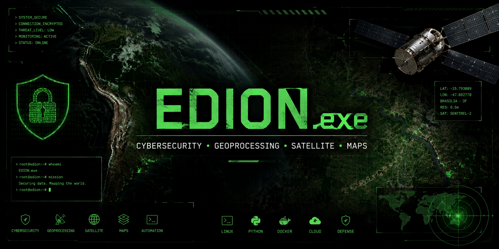

<div align="center">




<p align="center">
  
  
  
</p>

</div>

---

# 🛰️ SATELLITE_STATUS.sys

```bash
> Initializing geospatial engine...
> Loading satellite telemetry...
> Connecting secure infrastructure...
> Activating cyber defense modules...
> STATUS: OPERATIONAL
```

---

# 🕶️ PROFILE.yaml

```yaml
Name: Edion
Alias: EDION.exe
Location: Brazil

Focus:
  - Cybersecurity
  - DevSecOps
  - Linux Infrastructure
  - Python Automation
  - Geoprocessamento & SIG
  - Satellite Image Analysis
  - Cloud Security

Environment:
  OS: Linux
  Security: ENABLED
  Monitoring: ACTIVE

Languages:
  - Python
  - Bash
```

---

# 💀 ABOUT_ME.sys

```diff
+ Cybersecurity Enthusiast
+ Linux Infrastructure
+ Offensive & Defensive Security
+ Python Automation
+ Geospatial Intelligence
+ Satellite Image Analysis
+ Infrastructure Hardening
+ Continuous Learning
```

Atuo na proteção de ambientes, automação de infraestrutura e análise geoespacial utilizando imagens de satélite, mapas e tecnologias voltadas para segurança e monitoramento.

Minha área de interesse envolve:

- Segurança ofensiva e defensiva
- Hardening Linux
- Infraestrutura VPS
- Geoprocessamento e SIG
- Python para automação
- Observabilidade
- Containers
- Cloud Security
- Dados geoespaciais

---

<div align="center">

# 🌎 GEO VISUALIZATION


</div>

---

# 🚀 CURRENTLY_LEARNING.sh

```bash
[+] DevSecOps
[+] Docker & Containers
[+] Linux Hardening
[+] Geoprocessamento & SIG
[+] Python Automation
[+] QGIS & ArcGIS
[+] Satellite Image Processing
[+] SIEM Concepts
[+] Cloud Security
[+] Reverse Proxy
[+] Threat Monitoring
```

---

<div align="center">

# 🛠️ TECH STACK


<br><br>


</div>

---

<div align="center">

# 📊 GITHUB STATS


</div>

---

<div align="center">

# 🔥 CONTRIBUTION ACTIVITY


</div>

---

<div align="center">

# 🛰️ SATELLITE METRICS


</div>

---

# 🧠 CYBERSECURITY_DOMAINS.map

```yaml
Cybersecurity:
  - Pentest
  - Hardening
  - Threat Monitoring
  - Infrastructure Security

Geoprocessing:
  - QGIS
  - ArcGIS
  - Raster Analysis
  - Satellite Images

Infrastructure:
  - Linux
  - Docker
  - VPS
  - Networking
```

---

# 🎓 EDUCATION_AND_CERTS.log

```yaml
Education:
  - Curso Superior em Cibersegurança
  - Pós-graduação em Cibersegurança
  - Pós-graduação em Sensoriamento Remoto

Certifications:
  - EXIN ISO/IEC 27001
  - Redes de Computadores
  - DevSecOps Studies
```

---

<div align="center">

# 🌐 CONNECTIVITY_STATUS

```bash
> Secure satellite link established...
> Cyber defense modules enabled...
> EDION.exe initialized successfully...
> Welcome to my profile...
```


</div>
